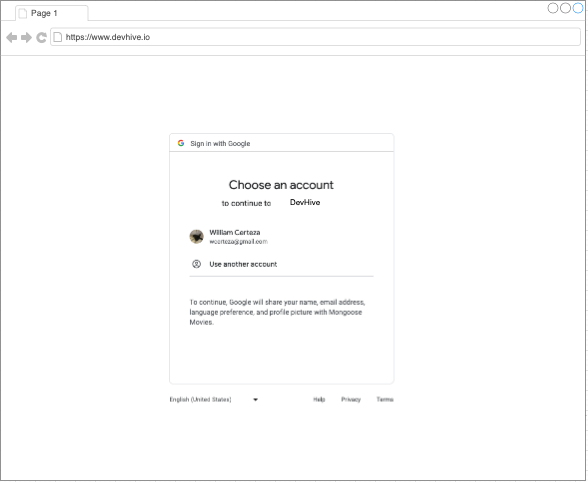

# DevHive Blog

## Date: 5/25/23

### By: Will Certeza

#### [GitHub](https://github.com/wcerteza)

---

### **_Description_**

#### Welcome to DevHive, a thriving community for developers of all levels! At DevHive, we believe in the power of collaboration and knowledge sharing to propel the world of coding forward. Our blog serves as a source of inspiration, insights, and practical tips for developers seeking to hone their skills and stay up-to-date with the latest industry trends. Whether you're a seasoned professional or just starting your coding journey, DevHive is here to support you with valuable resources, thought-provoking articles, and a vibrant community eager to connect and learn from one another. Join us at DevHive and be part of a buzzing hive of developers, fostering growth, and innovation in the world of technology.

---

### **_Technologies_**

---

### **_Hosting_**

---

### **_Wire Frame_**

---

### **_How To Get Started_**

- Create Trello Board
- Craft Wireframe
- Create README.md
- Insert scaffolding
- Code

---

### **_Refrences_**

---
